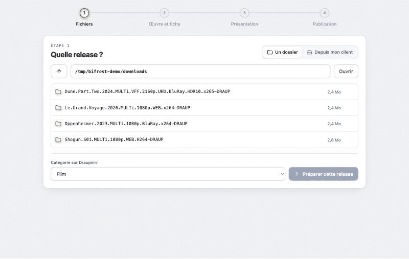
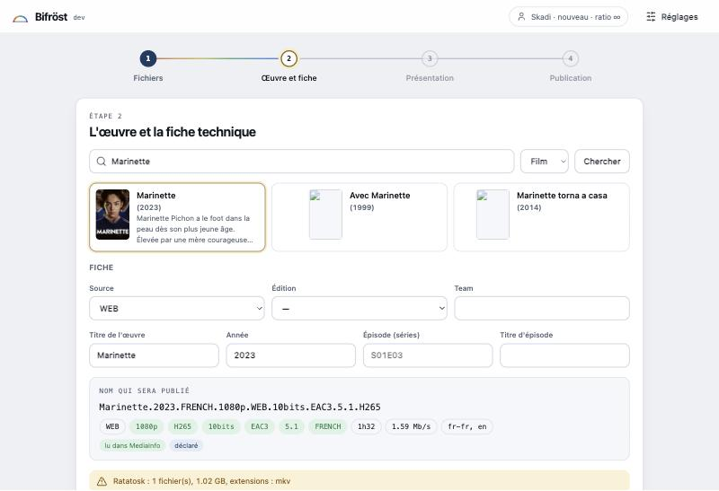
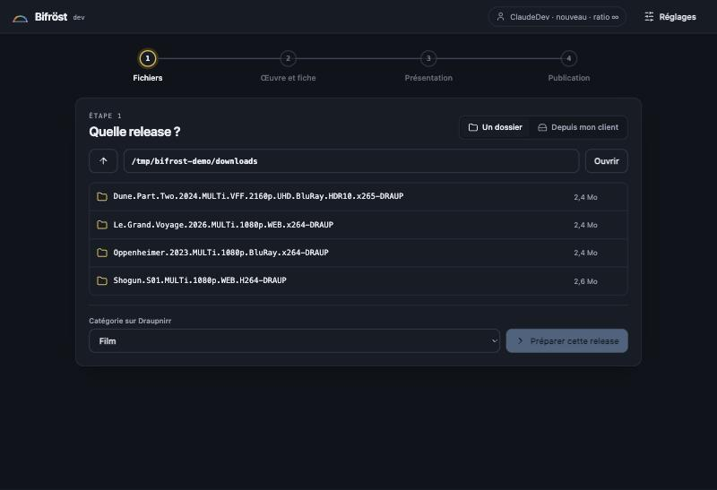

<p align="center">
  
</p>

<h1 align="center">Bifröst</h1>

<p align="center">
  L'outil d'upload de <b>Draupnirr</b> : un binaire, une page locale, zéro installation.<br>
  Il prépare la release, laisse Draupnirr calculer la fiche, et remet le <code>.torrent</code> dans ton client pour que tu seedes aussitôt.<br>
  Trois modes : <b>Uploader</b> une release à la main, <b>Cross-seed</b> en un clic ce que tu seedes déjà ailleurs, <b>Lot</b> pour publier un dossier entier sans y toucher.
</p>

<p align="center">
  <a href="https://github.com/MimirDraupnirr/bifrost/releases/latest"></a>
  <a href="https://github.com/MimirDraupnirr/bifrost/actions/workflows/ci.yml"></a>
  <a href="https://github.com/MimirDraupnirr/bifrost/actions/workflows/release.yml"></a>
  <a href="https://github.com/MimirDraupnirr/bifrost/pkgs/container/bifrost"></a>
  
  
  
  <a href="LICENSE"></a>
</p>

---

<p align="center">
  
</p>

## Pourquoi

Uploader proprement, c'est fastidieux : créer le `.torrent` avec le bon tag source, lancer MediaInfo, retrouver l'œuvre sur TMDB, respecter la nomenclature, rédiger une présentation, puis remettre le torrent du tracker dans son client pour seeder. Bifröst enchaîne tout ça en quatre étapes, **sans rien réinventer** : c'est Draupnirr qui calcule le nom canonique, lit les facettes dans MediaInfo et rend les avertissements de Ratatosk, exactement comme sur le site.

## Ce qu'il fait

| Étape | Ce qui se passe |
|---|---|
| **Fichiers** | Un dossier sur ce poste ou sur ta seedbox, ou directement un torrent déjà dans ton client. Les cross-seeds sont regroupés, ce qui est déjà sur Draupnirr se masque d'un geste. |
| **Œuvre et fiche** | Hachage (ou export du `.torrent` d'origine depuis qBittorrent, sans re-hachage), MediaInfo, recherche TMDB, puis la fiche : facettes lues dans le fichier en vert, déclarées en bleu, nom publié, manquants, verdict de Ratatosk. |
| **Présentation** | Tes modèles du profil (sinon celui du site pour la famille), variables remplies, images TMDB en un clic, barre d'outils BBCode/HTML, et l'**aperçu en temps réel rendu par Draupnirr**. |
| **Publication** | Envoi par l'API, récupération du `.torrent` personnalisé, ajout au client sur les mêmes données. Tu seedes tout de suite. |

### Cross-seed en un clic

Ce que tu seedes déjà pour d'autres trackers et qui existe sur Draupnirr se remet en seed ici aussi. Bifröst compare ton client au catalogue par **taille exacte**, départage par le nom, puis vérifie **fichier par fichier** que l'arborescence du `.torrent` Draupnirr est bien sur tes données avant de l'ajouter au client. Rien n'est téléchargé, rien n'est haché. Les cross-seeds déjà présents, sous quelque domaine de tracker que ce soit, ne sont jamais proposés.

### Lot : un dossier entier, sans y toucher

Tu donnes un dossier, Bifröst passe chaque entrée au crible : déjà sur Draupnirr → ignorée ; sinon hachage, MediaInfo, œuvre TMDB, fiche calculée par Draupnirr, **publication seulement si tout est sûr** — œuvre certaine (titre ou titre original, même année), facettes complètes, aucun avertissement de Ratatosk, aucun doublon. Le reste va en « à revoir » avec la raison, à finir dans l'onglet Uploader. Simulation par défaut, plafonds d'examen et de publication, filtre « vidéos seulement », arrêt propre, et une pause entre deux publications pour respecter l'API du site. Une entrée au-delà du plafond de taille (300 Go par défaut) est ignorée sans être hachée, et un dossier sans fichier à sa racine (un dossier de releases, pas une release) part « à revoir ». Les liens symboliques sont suivis : taille et hachage sont ceux des fichiers pointés.

Le tableau du lot se range en onglets par état (nouveau, en attente, simulé, à revoir, revu, erreur, déjà présent, ignoré, publié), avec recherche et cases à cocher : seules les lignes cochées de l'onglet affiché partent dans le lot. La **loupe** de chaque ligne montre les fichiers, le rapport MediaInfo et la fiche telle que Draupnirr la calcule ; on y choisit à la main l'œuvre TMDB (ou l'édition MusicBrainz) quand le lot s'est trompé ou n'a rien trouvé, on corrige la saison et les facettes, ou on **ignore** la release pour de bon. Une ligne dont l'œuvre a été choisie passe « revu » et le lot suivant prend ce choix tel quel au lieu de chercher. « Revoir à la suite » enchaîne les lignes affichées dans la loupe (flèches, Entrée, I) ; « Une œuvre pour ces N » rattache d'un coup plusieurs saisons d'une même série, chacune gardant la sienne. La saison est lue dans le nom (`S06`, `S01E03`, `S02E01-E02`) et transmise à Draupnirr : une série sans saison dans son nom part « à revoir ».

### Musique : un album, une discographie

Un dossier de pistes (FLAC, MP3, AAC, Ogg, Opus, WAV, APE, WavPack, AIFF) est reconnu comme un **album** : MediaInfo lit chaque piste, Draupnirr écrit le nom selon la nomenclature, compose le NFO avec la liste des pistes et propose la sous-catégorie. L'étape 2 cherche l'édition sur **MusicBrainz** (pochettes, « N pistes, comme ton dossier ») ; des tags Picard la donnent d'office. Source, type et team se déclarent à côté, et le modèle de présentation Musique — le tien, sinon celui du site — reçoit artiste, album, format et pistes.

En lot, l'option **Musique** fait de chaque dossier d'album une release, à toute profondeur : une discographie de 14 albums donne 14 releases, et `CD1`, `Disc 2`… restent avec leur album. L'édition MusicBrainz n'est retenue que si elle est la seule à avoir le même titre, le même artiste et autant de pistes ; sinon l'album part nommé d'après ses tags, ou va « à revoir » s'il manque l'artiste, l'album, l'année ou la source (un `.log` ou un `.cue` vaut CD ; sinon la source par défaut du lot).

<p align="center">
  
</p>

## Installer

### Le binaire, sur ton ordinateur

Télécharge le fichier de ta plateforme sur la page [Releases](https://github.com/MimirDraupnirr/bifrost/releases/latest) : macOS (Apple Silicon, Intel), Linux (amd64, arm64), Windows. Rends-le exécutable si besoin, lance-le : le navigateur s'ouvre sur `http://127.0.0.1:8790`. Aucun droit administrateur.

```bash
chmod +x bifrost_*_darwin_arm64 && ./bifrost_*_darwin_arm64
```

Au premier lancement, colle l'adresse du site et un **jeton API** créé dans *Profil › Sécurité › Jetons API*. Il reste sur ta machine, dans un fichier lisible par toi seul, et ne t'est jamais redemandé.

### Docker, en général sur la seedbox

```bash
docker run -d --name bifrost --restart unless-stopped -p 8790:8790 \
  -v bifrost-config:/config -v /chemin/vers/tes/downloads:/data:ro \
  ghcr.io/mimirdraupnirr/bifrost:latest
```

Un [`docker-compose.example.yml`](docker-compose.example.yml) est fourni, avec Watchtower en option pour les mises à jour sans geste. Hors loopback, la page exige un **mot de passe local** défini au premier accès.

## Sources de fichiers et clients

| | |
|---|---|
| **Ce poste** | parcours du disque, hachage et `mediainfo` locaux |
| **Seedbox par SSH** | clé ou mot de passe de session (jamais enregistré), empreinte d'hôte acceptée explicitement. Bifröst copie son propre binaire Linux dans `~/.bifrost` et l'exécute à la demande : **pas de démon, pas de port**, rien à désinstaller |
| **Client sur ce PC ou sur la seedbox** | Bifröst parle au client par son interface Web : active-la (qBittorrent : Outils › Options › Interface Web ; Transmission : Accès distant ; Deluge : plugin WebUI), puis « Détecter sur ce poste » remplit le type et l'adresse |
| **qBittorrent** | liste, export du `.torrent` d'origine, ajout sans re-vérification ; le torrent ajouté garde la disposition d'origine et démarre, quels que soient tes réglages par défaut |
| **rTorrent / ruTorrent, Transmission, Deluge** | liste et ajout ; les données sont re-hachées par la source |
| **Aucun client** | le `.torrent` est gardé dans un dossier, à ajouter à la main |
| **Chemins différents** | Bifröst en Docker et le client sous Windows ou hors du conteneur : *Réglages › Client torrent › Correspondance des chemins*, par exemple `/media/D_Test = D:\Test`. Bifröst traduit dans les deux sens, le client reçoit ses propres chemins |

<p align="center">
  
</p>

## Sécurité et vie privée

**Aucun identifiant ne transite par le serveur de Draupnirr.** Bifröst tourne sur ta machine ; la seule chose qu'il envoie au site est ce que tu publies — le `.torrent`, la fiche, la description, le rapport MediaInfo (le texte, jamais le fichier) — authentifié par le jeton API que Draupnirr t'a lui-même remis. Tout le reste reste chez toi :

| | Où ça vit | Ce que Draupnirr en voit |
|---|---|---|
| Clé SSH, mot de passe SSH, empreinte de ta seedbox | ta machine (le mot de passe n'est même pas écrit sur disque) | rien |
| Identifiants de ton client torrent | fichier de configuration local, lisible par toi seul | rien |
| Chemins de tes dossiers, contenu de ton client | ta machine et ta seedbox | rien |
| Jeton API | fichier de configuration local | lui seul, pour t'authentifier |

Bifröst parle à ta seedbox et à ton client **directement**, de ton poste. Le site n'est jamais un intermédiaire.

- **Jeton API** plutôt que passkey : révocable seul depuis le profil, sans couper tes clients torrent du swarm.
- **Mot de passe local** dès que la page n'écoute pas sur `127.0.0.1` (argon2id, session, pause croissante sur échec).
- **Les `.torrent` créés sont gardés en cache** (clé : source, chemin, taille) : relancer un lot ou re-préparer une release ne re-hache pas des gigaoctets déjà hachés.
- **Historique** : chaque lot, décision (publié, à revoir, revu, ignoré, déjà présent…), choix d'œuvre fait dans la loupe, publication et cross-seed est noté dans `history.jsonl`, à côté de `config.json` (une ligne JSON par événement, sans secret). La liste du lot rappelle la dernière décision de chaque entrée, décoche ce qui est déjà sur Draupnirr ou ignoré à la main, et reprend l'œuvre choisie dans la loupe tant que la taille de l'entrée n'a pas changé.
- **Le lot ne publie jamais dans le doute** : chaque garde-fou est une raison affichée, et la simulation montre exactement ce qui partirait.
- **Mises à jour signées** : au lancement, Bifröst vérifie la dernière release, contrôle la signature ed25519 de `checksums.txt` et le SHA-256 du binaire, se remplace et se relance. Rien n'est installé si la signature ne colle pas. Désactivable dans les Réglages. L'agent sur la seedbox suit la version du poste.
- Aucune dépendance réseau dans la page, pas de télémétrie. Le code est public : vérifie-le, `draupnirr.go` est le seul fichier qui parle au site.

## Développer

```bash
make test        # vet + tests
make build       # agents Linux (amd64, arm64) puis binaire du poste
./bifrost --no-browser --listen 127.0.0.1:8790 --config /tmp/bifrost.json

./bifrost agent mktorrent --source DRAUPNIRR /chemin/release > release.torrent
./bifrost agent mediainfo /chemin/release/film.mkv        # ou un dossier d'album : un objet par piste
./bifrost agent albums /chemin/discographie              # les dossiers d'album que le lot musique publierait
./bifrost agent verify checksums.txt checksums.txt.sig   # une release est-elle signée par la clé de ce build ?
```

Go, bibliothèque standard et `x/crypto` seulement ; page en HTML, CSS et JavaScript natifs, embarquée dans le binaire. Une release = un tag `vX.Y.Z` : goreleaser publie les binaires et `checksums.txt`, le workflow signe `checksums.txt.sig`, et l'image multi-arch part sur ghcr.io.

Conception, décisions et historique : `docs/23-BIFROST-OUTIL-UPLOAD-GO.md` du dépôt Draupnirr.

## Contribuer

Lis [CONTRIBUTING.md](CONTRIBUTING.md) avant d'ouvrir une PR, et [SECURITY.md](SECURITY.md) pour signaler une faille en privé. La CI vérifie `gofmt`, `go vet`, les tests, la compilation croisée et `govulncheck` ; une release est un tag `vX.Y.Z` (binaires signés + image Docker).

## Licence

[MIT](LICENSE).
