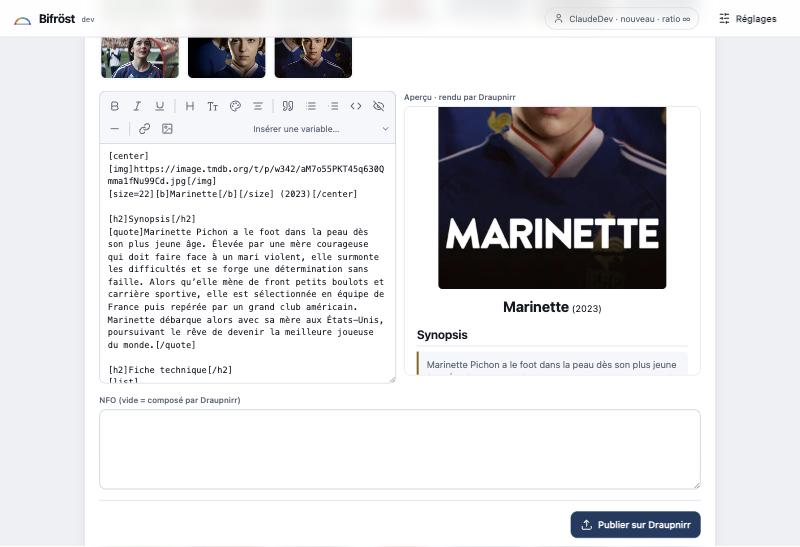

<p align="center">
  
</p>

<h1 align="center">Bifröst</h1>

<p align="center">
  L'outil d'upload de <b>Draupnirr</b> : un binaire, une page locale, zéro installation.<br>
  Il prépare la release, laisse Draupnirr calculer la fiche, et remet le <code>.torrent</code> dans ton client pour que tu seedes aussitôt.
</p>

<p align="center">
  <a href="https://github.com/MimirDraupnirr/bifrost/releases/latest"></a>
  <a href="https://github.com/MimirDraupnirr/bifrost/actions/workflows/ci.yml"></a>
  <a href="https://github.com/MimirDraupnirr/bifrost/actions/workflows/release.yml"></a>
  <a href="https://github.com/MimirDraupnirr/bifrost/pkgs/container/bifrost"></a>
  
  
  
  <a href="LICENSE"></a>
</p>

---

## Pourquoi

Uploader proprement, c'est fastidieux : créer le `.torrent` avec le bon tag source, lancer MediaInfo, retrouver l'œuvre sur TMDB, respecter la nomenclature, rédiger une présentation, puis remettre le torrent du tracker dans son client pour seeder. Bifröst enchaîne tout ça en quatre étapes, **sans rien réinventer** : c'est Draupnirr qui calcule le nom canonique, lit les facettes dans MediaInfo et rend les avertissements de Ratatosk, exactement comme sur le site.

## Ce qu'il fait

| Étape | Ce qui se passe |
|---|---|
| **Fichiers** | Un dossier sur ce poste ou sur ta seedbox, ou directement un torrent déjà dans ton client. Les cross-seeds sont regroupés, ce qui est déjà sur Draupnirr se masque d'un geste. |
| **Œuvre et fiche** | Hachage (ou export du `.torrent` d'origine depuis qBittorrent, sans re-hachage), MediaInfo, recherche TMDB, puis la fiche : facettes lues dans le fichier en vert, déclarées en bleu, nom publié, manquants, verdict de Ratatosk. |
| **Présentation** | Tes modèles du profil, variables remplies, images TMDB en un clic, barre d'outils BBCode/HTML, et l'**aperçu en temps réel rendu par Draupnirr**. |
| **Publication** | Envoi par l'API, récupération du `.torrent` personnalisé, ajout au client sur les mêmes données. Tu seedes tout de suite. |

<p align="center">
  
</p>

## Installer

### Le binaire, sur ton ordinateur

Télécharge le fichier de ta plateforme sur la page [Releases](https://github.com/MimirDraupnirr/bifrost/releases/latest) : macOS (Apple Silicon, Intel), Linux (amd64, arm64), Windows. Rends-le exécutable si besoin, lance-le : le navigateur s'ouvre sur `http://127.0.0.1:8790`. Aucun droit administrateur.

```bash
chmod +x bifrost_*_darwin_arm64 && ./bifrost_*_darwin_arm64
```

Au premier lancement, colle l'adresse du site et un **jeton API** créé dans *Profil › Sécurité › Jetons API*. Il reste sur ta machine, dans un fichier lisible par toi seul, et ne t'est jamais redemandé.

### Docker, en général sur la seedbox

```bash
docker run -d --name bifrost --restart unless-stopped -p 8790:8790 \
  -v bifrost-config:/config -v /chemin/vers/tes/downloads:/data:ro \
  ghcr.io/mimirdraupnirr/bifrost:latest
```

Un [`docker-compose.example.yml`](docker-compose.example.yml) est fourni, avec Watchtower en option pour les mises à jour sans geste. Hors loopback, la page exige un **mot de passe local** défini au premier accès.

## Sources de fichiers et clients

| | |
|---|---|
| **Ce poste** | parcours du disque, hachage et `mediainfo` locaux |
| **Seedbox par SSH** | clé ou mot de passe de session (jamais enregistré), empreinte d'hôte acceptée explicitement. Bifröst copie son propre binaire Linux dans `~/.bifrost` et l'exécute à la demande : **pas de démon, pas de port**, rien à désinstaller |
| **qBittorrent** | liste, export du `.torrent` d'origine, ajout sans re-vérification |
| **rTorrent / ruTorrent, Transmission, Deluge** | liste et ajout ; les données sont re-hachées par la source |
| **Aucun client** | le `.torrent` est gardé dans un dossier, à ajouter à la main |

<p align="center">
  
</p>

## Sécurité et vie privée

**Aucun identifiant ne transite par le serveur de Draupnirr.** Bifröst tourne sur ta machine ; la seule chose qu'il envoie au site est ce que tu publies — le `.torrent`, la fiche, la description, le rapport MediaInfo (le texte, jamais le fichier) — authentifié par le jeton API que Draupnirr t'a lui-même remis. Tout le reste reste chez toi :

| | Où ça vit | Ce que Draupnirr en voit |
|---|---|---|
| Clé SSH, mot de passe SSH, empreinte de ta seedbox | ta machine (le mot de passe n'est même pas écrit sur disque) | rien |
| Identifiants de ton client torrent | fichier de configuration local, lisible par toi seul | rien |
| Chemins de tes dossiers, contenu de ton client | ta machine et ta seedbox | rien |
| Jeton API | fichier de configuration local | lui seul, pour t'authentifier |

Bifröst parle à ta seedbox et à ton client **directement**, de ton poste. Le site n'est jamais un intermédiaire.

- **Jeton API** plutôt que passkey : révocable seul depuis le profil, sans couper tes clients torrent du swarm.
- **Mot de passe local** dès que la page n'écoute pas sur `127.0.0.1` (argon2id, session, pause croissante sur échec).
- **Mises à jour signées** : au lancement, Bifröst vérifie la dernière release, contrôle la signature ed25519 de `checksums.txt` et le SHA-256 du binaire, se remplace et se relance. Rien n'est installé si la signature ne colle pas. Désactivable dans les Réglages. L'agent sur la seedbox suit la version du poste.
- Aucune dépendance réseau dans la page, pas de télémétrie. Le code est public : vérifie-le, `draupnirr.go` est le seul fichier qui parle au site.

## Développer

```bash
make test        # vet + tests
make build       # agents Linux (amd64, arm64) puis binaire du poste
./bifrost --no-browser --listen 127.0.0.1:8790 --config /tmp/bifrost.json

./bifrost agent mktorrent --source DRAUPNIRR /chemin/release > release.torrent
./bifrost agent mediainfo /chemin/release/film.mkv
./bifrost agent verify checksums.txt checksums.txt.sig   # une release est-elle signée par la clé de ce build ?
```

Go, bibliothèque standard et `x/crypto` seulement ; page en HTML, CSS et JavaScript natifs, embarquée dans le binaire. Une release = un tag `vX.Y.Z` : goreleaser publie les binaires et `checksums.txt`, le workflow signe `checksums.txt.sig`, et l'image multi-arch part sur ghcr.io.

Conception, décisions et historique : `docs/23-BIFROST-OUTIL-UPLOAD-GO.md` du dépôt Draupnirr.

## Contribuer

Lis [CONTRIBUTING.md](CONTRIBUTING.md) avant d'ouvrir une PR, et [SECURITY.md](SECURITY.md) pour signaler une faille en privé. La CI vérifie `gofmt`, `go vet`, les tests, la compilation croisée et `govulncheck` ; une release est un tag `vX.Y.Z` (binaires signés + image Docker).

## Licence

[MIT](LICENSE).
